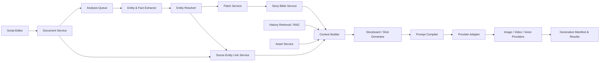

# 系统架构与核心领域模型

> 对应原规范第 3–4 章；章节编号与规范关键词保持不变。

## 3. 系统架构

### 3.1 逻辑架构



### 3.2 运行时分层

1. **Authoring Plane**：文档、Scene、mention、实体候选、Patch 审核。
2. **Knowledge Plane**：Story Bible、Canon、Inference、关系、状态、事件、素材绑定。
3. **Generation Plane**：Context Builder、Storyboard、Shot、Prompt Compiler、Provider Adapter、任务和结果。
4. **Audit Plane**：版本、provenance、运行记录、输入快照、成本、错误和回放。

### 3.3 推荐部署形态

MVP SHOULD 采用模块化单体和异步 Worker，不要过早拆微服务：

```text
apps/
  web/
  api/
  worker/
packages/
  domain/
  schemas/
  document/
  extraction/
  story-bible/
  context-builder/
  prompt-compiler/
  provider-adapters/
  generation/
```

模块之间通过明确接口和领域事件通信，使后续可独立扩容，但 MVP 保留单一数据库事务边界。

---

## 4. 核心实体与建议数据结构

### 4.1 领域对象层级

```text
Workspace
└── Project
    ├── ScriptDocument
    │   ├── Chapter
    │   └── Scene
    │       ├── Beat
    │       └── Shot
    ├── StoryBible
    │   ├── Entity
    │   │   ├── Character
    │   │   ├── Location
    │   │   ├── Prop
    │   │   ├── Organization
    │   │   └── Event
    │   ├── Relationship
    │   ├── Fact
    │   ├── State
    │   └── Asset
    └── Generation
        ├── ContextSnapshot
        ├── GenerationManifest
        └── MediaAsset
```

### 4.2 Entity

所有实体共享统一 envelope，具体类型使用经过版本控制的 `attributes` schema。

```ts
type EntityType =
  | "character"
  | "location"
  | "prop"
  | "organization"
  | "event";

interface Entity {
  id: string;                 // UUID, immutable
  projectId: string;
  type: EntityType;
  canonicalName: string;
  aliases: string[];
  status: "draft" | "active" | "archived" | "merged";
  mergedIntoEntityId?: string;
  schemaVersion: number;
  attributes: Record<string, unknown>; // only stable, typed base fields
  version: number;            // optimistic concurrency
  createdAt: string;
  updatedAt: string;
}
```

约束：

- `canonicalName` 不是唯一标识，同名角色允许存在。
- alias 只在项目范围内解析；有歧义时不得自动链接。
- `attributes` 不存来源不明的自由文本事实；需要来源和状态的事实进入 `facts`。
- 合并实体采用 redirect，不物理删除被合并 ID。

### 4.3 Character Profile（领域读模型）

角色卡是聚合读模型，不应等同于单表中的 JSON blob。

```ts
interface CharacterProfile {
  entity: Entity;
  baseFacts: FactView[];
  inferredFacts: InferenceView[];
  relationships: RelationshipView[];
  visualIdentity: {
    traits: FactView[];
    referenceAssets: AssetRef[];
    providerBindings: ProviderBindingView[];
  };
  voiceIdentity: {
    traits: FactView[];
    referenceAssets: AssetRef[];
    providerBindings: ProviderBindingView[];
  };
}
```

建议的角色事实路径：

```text
identity.age
identity.gender_expression
identity.occupation
appearance.face
appearance.hair
appearance.eye_color
appearance.body_type
appearance.distinctive_features[]
personality.traits[]
motivation.want
motivation.need
motivation.lie
background.summary
speech.style
visual.default_wardrobe
voice.language
voice.timbre
```

字段路径必须由 schema registry 管理，不允许客户端随意制造拼写不同但含义相同的路径。

### 4.4 Fact

Fact 采用原子记录，便于来源追踪、冲突判断和按字段编译。

```ts
interface Fact {
  id: string;
  projectId: string;
  subjectEntityId: string;
  predicate: string;           // e.g. "appearance.hair"
  value: unknown;
  valueType: "string" | "number" | "boolean" | "enum" | "entity_ref" | "json";
  truthClass: "canon";        // inferred is stored separately
  scope: "base" | "scene" | "range";
  sceneId?: string;
  validFromSceneId?: string;
  validToSceneId?: string;
  sourceId: string;
  status: "active" | "superseded" | "retracted";
  supersedesFactId?: string;
  version: number;
}
```

### 4.5 Inference

```ts
interface Inference {
  id: string;
  projectId: string;
  subjectEntityId: string;
  predicate: string;
  value: unknown;
  confidence: number;          // 0..1, not comparable across model families by default
  evidenceSourceIds: string[];
  rationale?: string;          // concise, no hidden chain-of-thought requirement
  modelRunId: string;
  status: "active" | "dismissed" | "promoted" | "stale";
  createdAt: string;
}
```

将 Inference “转正”时必须创建新的 Canon Fact，并记录 `promoted_from_inference_id`；不得原地修改 `truthClass`。

### 4.6 Relationship

关系是有方向、有类型、可随剧情变化的边。

```ts
interface Relationship {
  id: string;
  projectId: string;
  fromEntityId: string;
  toEntityId: string;
  relationType: string;        // e.g. "sibling_of", "works_for", "owns"
  attributes?: Record<string, unknown>;
  truthClass: "canon" | "inferred";
  scope: "base" | "scene" | "range";
  validFromSceneId?: string;
  validToSceneId?: string;
  sourceId: string;
  status: "active" | "superseded" | "retracted";
}
```

对称关系（如 `sibling_of`）由关系 schema 声明对称性，查询层负责双向读取；不要重复插入两条事实。

### 4.7 Event

Event 表达“发生了什么”，State 表达“某时是什么状态”。

```ts
interface StoryEvent {
  id: string;
  projectId: string;
  sceneId: string;
  eventType: string;
  summary: string;
  participantEntityIds: string[];
  causesEventIds: string[];
  effects: StateMutation[];
  sourceId: string;
  truthClass: "canon" | "inferred";
}
```

MVP 可以只保存 Event 及 effects 提议，不实现通用规则引擎。

### 4.8 Source 与 Provenance

```ts
interface EvidenceSource {
  id: string;
  projectId: string;
  kind: "text_span" | "user_input" | "import" | "asset" | "model_output";
  documentId?: string;
  sceneId?: string;
  revisionId?: string;
  anchorStart?: string;       // editor-native stable anchor, not only integer offset
  anchorEnd?: string;
  quotedText?: string;
  createdByUserId?: string;
  modelRunId?: string;
  createdAt: string;
}
```

编辑器 SHOULD 使用可随协同编辑变化映射的稳定 anchor。纯字符 offset 只可作为快照信息，不能作为长期唯一定位。

---

