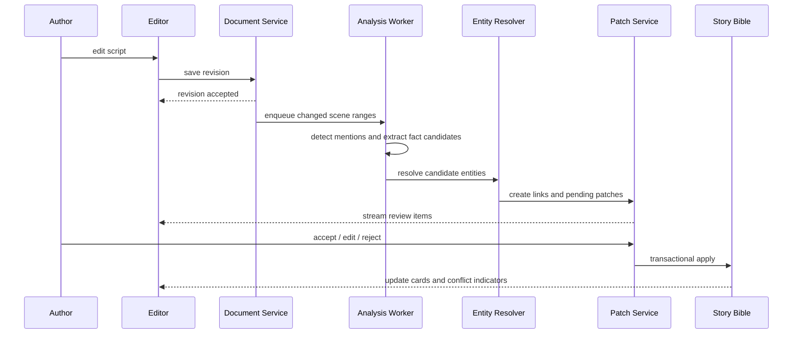

# 写作与视频化工作流

> 对应原规范第 8–9 章；章节编号与规范关键词保持不变。

## 8. 写作阶段工作流

### 8.1 主流程



### 8.2 增量分析要求

- 以 Scene 或 changed block 为最小重算单元，不得每次重跑全项目。
- 编辑保存成功后立即返回；分析通过 queue 异步执行。
- 每个任务带 `document_revision_id` 和内容 hash。
- Worker 提交结果前检查 revision；过期结果标为 stale，不写入当前视图。
- 相同 revision + analyzer version + content hash 的任务必须幂等。
- UI 应显示 `analyzing / up to date / failed`，但失败不阻塞编辑。

### 8.3 分析流水线

建议拆为以下阶段：

1. **Structure Parser**：解析 Chapter、Scene heading、action、dialogue、speaker。
2. **Mention Detector**：查找名称、别名、代词、地点、道具、组织、事件触发词。
3. **Entity Resolver**：连接已有实体，或提出新实体 stub。
4. **Fact Extractor**：输出原子事实候选、scope、证据范围。
5. **State/Event Extractor**：识别换装、受伤、移动、获得/丢失道具等变化。
6. **Conflict Detector**：与现有 Canon 比较。
7. **Patch Builder**：把候选转为 schema-valid Pending Patch。
8. **Link Projector**：维护 SceneEntityLink candidate/confirmed 读模型。

### 8.4 模型输出约束

模型只能输出指定 JSON Schema，不得输出 SQL 或数据库操作。示例：

```json
{
  "mentions": [
    {
      "surface": "林默",
      "entity_type": "character",
      "anchor_start": "a_102",
      "anchor_end": "a_104",
      "candidate_entity_id": "char_linmo"
    }
  ],
  "fact_candidates": [
    {
      "subject_entity_id": "char_linmo",
      "predicate": "appearance.distinctive_features",
      "operation": "append",
      "value": "左耳佩戴银色耳钉",
      "scope": "base",
      "explicitness": "explicit",
      "evidence_anchor_start": "a_130",
      "evidence_anchor_end": "a_142",
      "confidence": 0.98
    }
  ]
}
```

服务端必须重新校验 entity、predicate、scope、anchor、权限和版本。不能信任模型给出的 ID、置信度或 explicitness。

### 8.5 用户审核体验最低要求

每个 Patch 应展示：

- 建议变更前后值；
- 原文证据和所在 Scene；
- Canon / Inferred 类型；
- 是否与现有设定冲突；
- 接受、编辑后接受、拒绝；
- 批量接受仅限同类、无冲突 Patch。

拒绝理由 MAY 作为 resolver/extractor 的项目级反馈，但不得直接用于跨项目训练，除非另有授权。

---

## 9. 视频化阶段工作流

### 9.1 主流程

```text
Select Scene revision
  -> resolve confirmed SceneEntityLinks
  -> resolve Base + Scene State + location/prop state
  -> fetch approved reference assets/provider bindings
  -> retrieve only necessary history
  -> build immutable Context Snapshot
  -> Storyboard Generator
  -> author review/edit
  -> Shot Generator
  -> Prompt Compiler(target capability profile)
  -> Provider Adapter
  -> submit/poll/callback
  -> save result + Generation Manifest
```

### 9.2 视频化输入

视频化操作 MUST 固定以下版本：

- project/story bible revision；
- script document revision；
- Scene ID 与 Scene content hash；
- confirmed links revision；
- entity/fact/state 版本；
- reference asset 版本；
- context policy 和 compiler version；
- provider capability profile version。

生成进行中时即使作者继续编辑，也不得悄悄改变本次任务输入。用户可选择用最新版本重新编译。

### 9.3 Storyboard 与 Shot 分离

- `Storyboard Generator` 决定 Scene 的视觉节拍、镜头序列、构图意图和连续性。
- `Shot Generator` 生成单镜头的结构化规格。
- `Prompt Compiler` 只把已决定的 Shot Spec 和 Context 编译成模型输入，不负责改剧情。

```ts
interface ShotSpec {
  id: string;
  sceneId: string;
  ordinal: number;
  narrativePurpose: string;
  subjects: Array<{
    entityId: string;
    action: string;
    expression?: string;
    framingRole: "primary" | "secondary" | "background";
  }>;
  locationEntityId?: string;
  propEntityIds: string[];
  framing?: string;
  cameraMotion?: string;
  lens?: string;
  durationSeconds?: number;
  dialogueLineIds?: string[];
  continuityConstraints: string[];
  negativeConstraints: string[];
}
```

### 9.4 生成前阻断条件

以下情况默认阻止最终提交并显示可操作错误：

- Shot 中主体没有 confirmed entity link；
- 关键角色存在未解决的 hard Canon conflict；
- 指定 Provider 必需的 reference/character binding 缺失；
- 状态解析得到多个同优先级值；
- Context Snapshot 基于已删除 Scene；
- 资产权限、内容安全或格式校验不通过。

非关键字段缺失可 warning + fallback，但 Manifest 必须记录 fallback。

---

