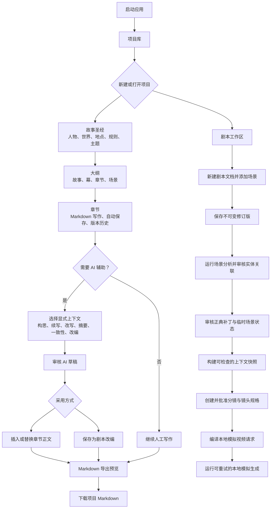
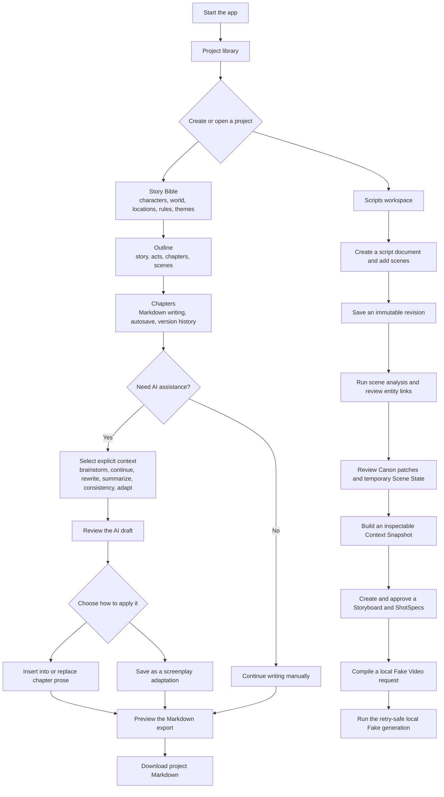

# Story Workspace 使用说明 / User Guide

界面右上角提供 `中文 / English` 切换。选择会保存在当前浏览器中，刷新或重新打开项目后仍然生效。语言切换只影响系统界面、日期和数字格式，不会翻译或改写作品内容。

Use the `中文 / English` control in the upper-right corner to switch languages. The choice is saved in the current browser and survives refreshes. It changes system copy, dates, and number formatting only; story content is never translated or rewritten.

## 中文节点图



## English node graph



## 开始使用 / Getting started

```powershell
npm ci
.\start-local.ps1
```

浏览器打开 `http://localhost:3000`。如需实时 AI 辅助，请在 `.env.local` 中配置 `AI_API_KEY` 和 `AI_MODEL`；未配置时，写作、保存、版本历史、剧本分析和确定性的本地模拟链路仍可使用。

Open `http://localhost:3000` in a browser. For live AI assistance, configure `AI_API_KEY` and `AI_MODEL` in `.env.local`. Writing, saving, version history, script analysis, and the deterministic local simulation flow remain available without them.

> 当前版本是本地单用户 MVP。视频链路使用本地 Fake Provider，只生成可检查记录，不上传素材、不调用真实媒体供应商，也不产生媒体文件或费用。
>
> The current release is a local single-user MVP. The video flow uses a local Fake Provider and creates inspectable records only. It does not upload assets, call a real media provider, produce a media file, or incur charges.
